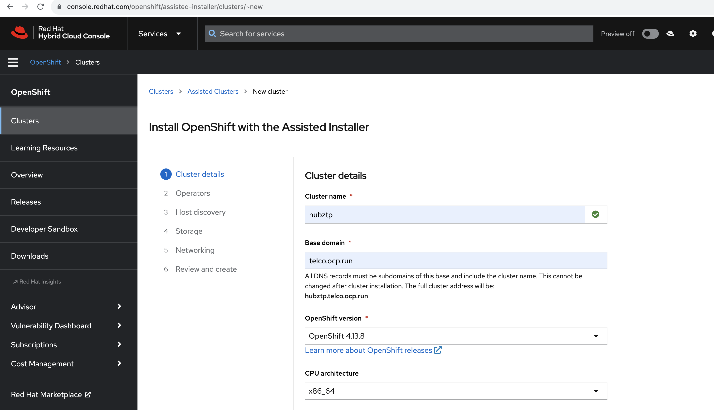
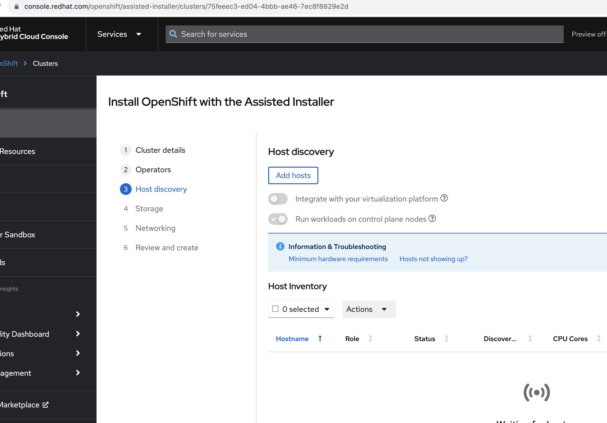
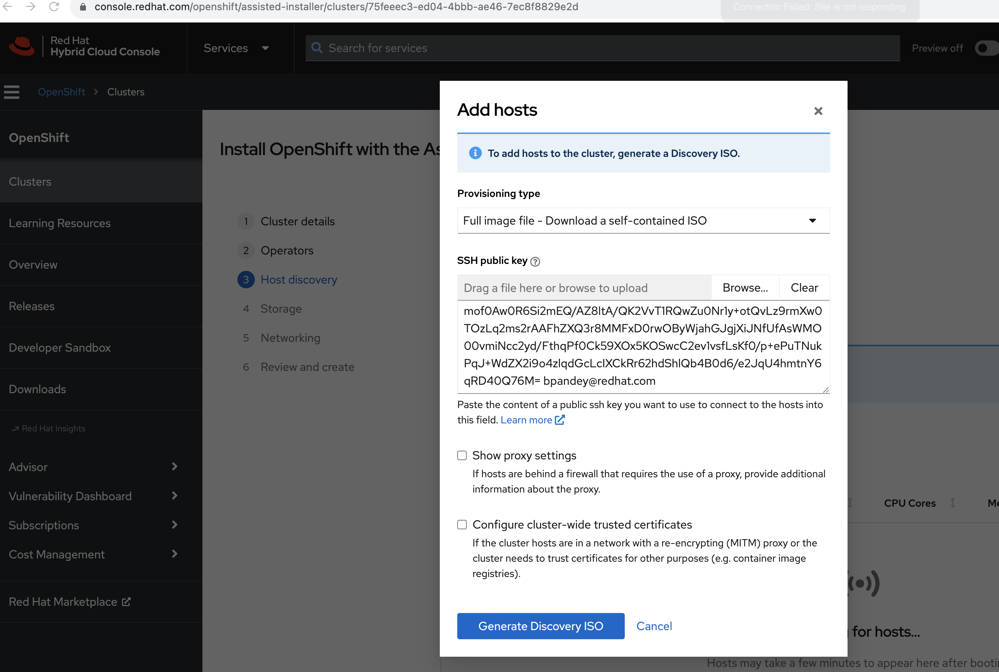
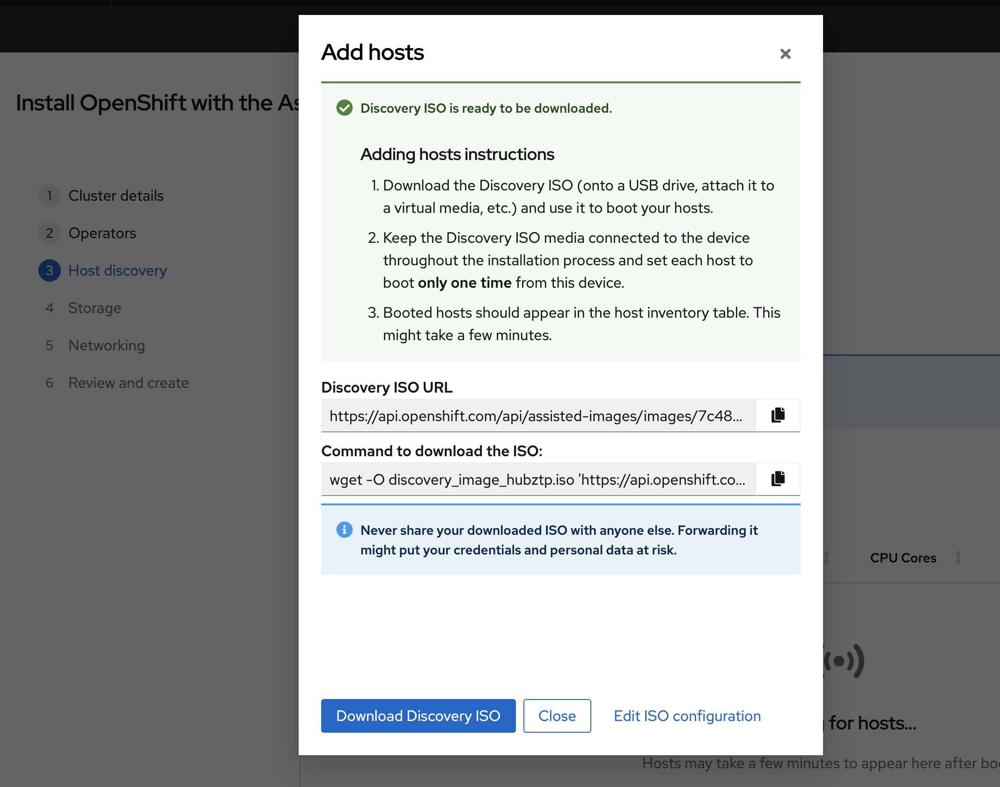

- [GitOps Demonstration with Red Hat Advanced Cluster Management (RHACM) and Assisted Installer](#gitops-demonstration-with-red-hat-advanced-cluster-management-rhacm-and-assisted-installer)
  - [Objective](#objective)
  - [001 - Overview](#001---overview)
    - [Red Hat Advanced Cluster Management (RHACM):](#red-hat-advanced-cluster-management-rhacm)
    - [Assisted Installer:](#assisted-installer)
    - [KVM \& Sushy-Tools:](#kvm--sushy-tools)
    - [Red Hat GitOps \& Tekton Pipelines:](#red-hat-gitops--tekton-pipelines)
  - [001 - Bridge Network Setup - `br0` - Optional](#001---bridge-network-setup---br0---optional)
    - [Preface](#preface)
    - [Objective](#objective-1)
    - [Steps to Set Up `br0`](#steps-to-set-up-br0)
    - [Post-setup Configuration Details](#post-setup-configuration-details)
    - [Important Notes](#important-notes)
  - [002 - Hub Cluster Setup - hubztp](#002---hub-cluster-setup---hubztp)
    - [Generating ISO Image using Assisted Installer](#generating-iso-image-using-assisted-installer)
    - [Important Notes](#important-notes-1)
    - [Downloading the ISO Image for `hubztp`](#downloading-the-iso-image-for-hubztp)
    - [Setting Up Hub Cluster VMs](#setting-up-hub-cluster-vms)
      - [Script Execution](#script-execution)

# GitOps Demonstration with Red Hat Advanced Cluster Management (RHACM) and Assisted Installer

## Objective

The primary goal of this project is to showcase the GitOps functionality using a combination of Red Hat tools, emulated bare metal infrastructure, and Tekton pipelines.


## 001 - Overview
This demonstration integrates several tools and technologies to showcase the power and flexibility of GitOps in a modern infrastructure:

### Red Hat Advanced Cluster Management (RHACM):
- RHACM is a comprehensive cluster management solution from Red Hat, designed to simplify the life-cycle of Kubernetes clusters, from creation to management and application deployment.
- Role in this project: RHACM will oversee and manage the Kubernetes clusters, ensuring they're compliant with defined policies, and helping in scaling, upgrading, or recovering clusters as necessary.

### Assisted Installer:
- An innovative deployment tool crafted for OpenShift Container Platform (OCP) clusters. It streamlines the process of setting up a Kubernetes cluster, especially on challenging environments like bare metal.
- Role in this project: We'll use Assisted Installer to deploy OCP onto our emulated bare metal environment. It'll interact with the emulated Redfish API, believing it's deploying to genuine bare metal servers.

### KVM & Sushy-Tools:
- KVM stands for Kernel-based Virtual Machine, a virtualization technology built into the Linux kernel. Sushy-Tools, on the other hand, simulates a Redfish API for systems that lack genuine Redfish support, like our KVM virtual machines.
- Role in this project: KVM creates the foundational virtual infrastructure for our demonstration. Sushy-Tools will act as a translator, making these VMs appear as Redfish compliant bare metal machines. This illusion allows Assisted Installer to deploy OCP clusters as if it's a true bare metal environment.

### Red Hat GitOps & Tekton Pipelines:
- Red Hat GitOps is a solution that enforces infrastructure and application configurations to be defined and stored in a Git repository. Tekton Pipelines is a powerful Kubernetes-native CI/CD solution that can be used to deploy and manage applications and infrastructure.
- Role in this project: With the GitOps principle, any change to our infrastructure or application state will start as a change in our Git repository. Tekton Pipelines will continuously ensure that our live environment matches this desired state, making the infrastructure-as-code paradigm a reality.

## 001 - Bridge Network Setup - `br0` - Optional
### Preface
The instructions in this section are specific to our project infrastructure, revolving around the use of the `eno1np0` physical interface to create a bridge network. While multiple methods exist to set up bridge networks, the steps detailed here are based on our unique configuration.

If your environment or requirements differ, you may choose to adapt the steps provided or skip this section.

### Objective
For this project, we are creating a bridge network, named `br0`, to link our KVM virtual machines to the external network. This ensures seamless communication and proper network functionality between our VMs and the broader environment.

### Steps to Set Up `br0`
- Navigate to the setup directory:
```
cd 001-hubcluster-setup
```
- Run the bridge network creation script:
```
bash 001-create-bridge-network.sh
```
Executing this script will automate the creation of the `br0` bridge using the eno1np0 physical interface and assign it an IP address of `192.168.7.212/22`.

### Post-setup Configuration Details
- Physical Interface (eno1np0): Retains its IP address (`192.168.7.213/24`) even after the bridge's creation.
- Bridge Interface (br0): Acquires an IP address of `192.168.7.212/22`. This address will be used by VMs or other devices connected to the bridge for external communications.

### Important Notes
- The `br0` bridge acts much like a switch, with `eno1np0` serving as its port. VMs connected to this bridge can interact with the physical network via `eno1np0`.
- It's crucial to ensure that firewall settings, if applicable, are adjusted to facilitate traffic through both the `br0` interface and `eno1np0`.
- Remember, this is a unique configuration where both the bridge and the physical interface retain individual IP addresses. Ensure proper routing and network configurations to avoid potential issues.

## 002 - Hub Cluster Setup - hubztp
In this section, we'll focus on setting up a hub cluster consisting of three nodes. This cluster setup will leverage virtual machines (VMs) to simulate bare metal nodes. For ease of setup, we have a scripted approach.

### Generating ISO Image using Assisted Installer
The first step is to generate the necessary ISO image to provision the hub cluster nodes:
- Visit [Red Hat OpenShift Cluster Manager](https://console.redhat.com/).
- Navigate to the [Assisted Installer](https://console.redhat.com/openshift/create/datacenter) service.
- Follow the instructions to generate an ISO image tailored for your hub cluster setup. This image will be used to boot and provision the nodes.






### Important Notes
- Ensure that all prerequisites, especially QEMU and `virt-install`, are already installed and configured on the system.
- As the VMs are simulating bare metal nodes, ensure the ISO generated from the Assisted Installer is compatible and has the necessary drivers and configurations.
- Monitoring the provisioning process from the Assisted Installer on the Red Hat OpenShift Cluster Manager portal will give you a real-time status of each node and the overall cluster setup.

### Downloading the ISO Image for `hubztp`
After generating the ISO image using Assisted Installer, the next step is to download it. This image contains all the configurations and software needed to provision our simulated bare metal nodes, i.e., the virtual machines we are going to set up in the next section.

Once the ISO generation is complete, you'll find a download option for the ISO in the Assisted Installer section of the Red Hat OpenShift Cluster Manager portal.


### Setting Up Hub Cluster VMs
The script uses QEMU to create images and `virt-install` to set up the VMs. It sets up three nodes, each with 50GB of RAM and 16 vCPUs, using the `qcow2` format for the virtual hard drives.

- Each VM image is created with a size of 200GB.
- The virtual machines are named with a pattern (`${CLUSTER_NAME}-master-x`).
- VMs are associated with the `br0` network bridge created in the previous step.
- A unique MAC address is assigned to each VM for identification.

#### Script Execution
> Caution: The ISO location in the script is hardcoded. Ensure to download the ISO to the specified location: `/opt/ssd/boot/discovery_image_${CLUSTER_NAME}.iso` or adjust the script accordingly.

Navigate to the `001-hubcluster-setup` directory and run:
```
cd 001-hubcluster-setup
bash 002-create-hubvms-mno.sh
```

This script initializes the VMs and starts them.
