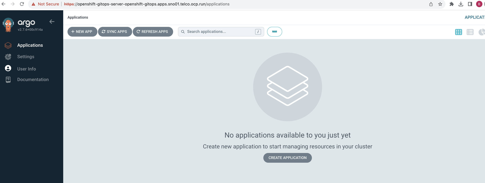
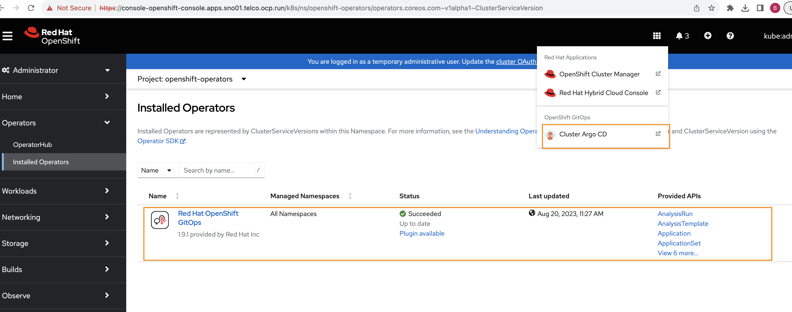
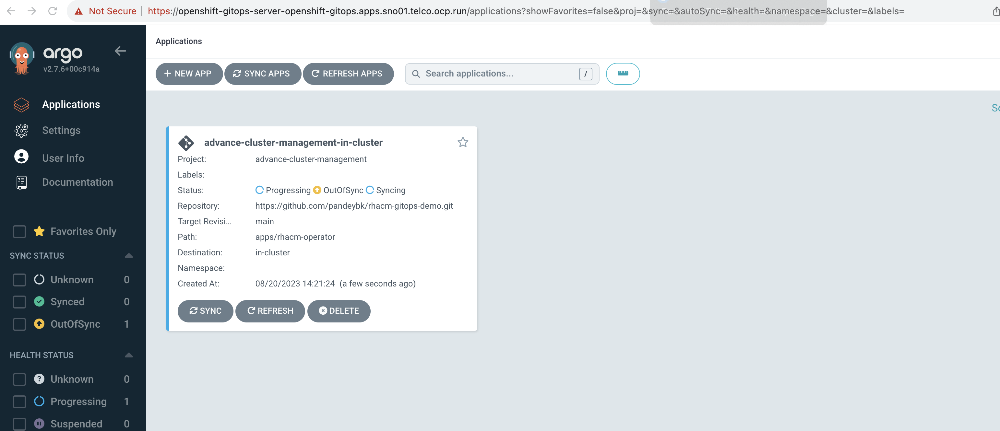
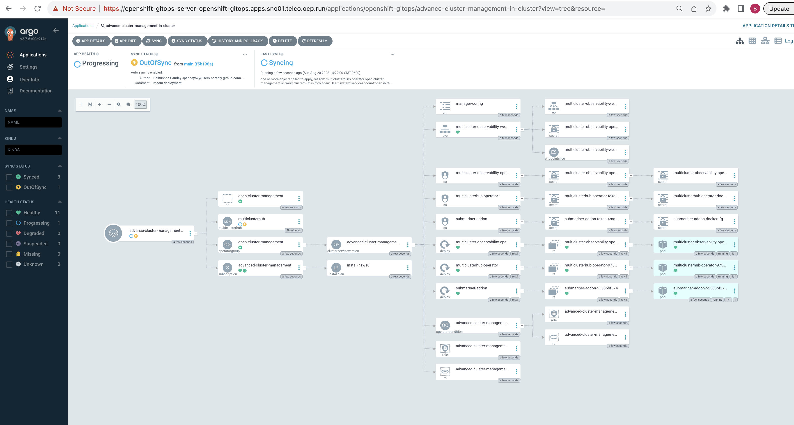
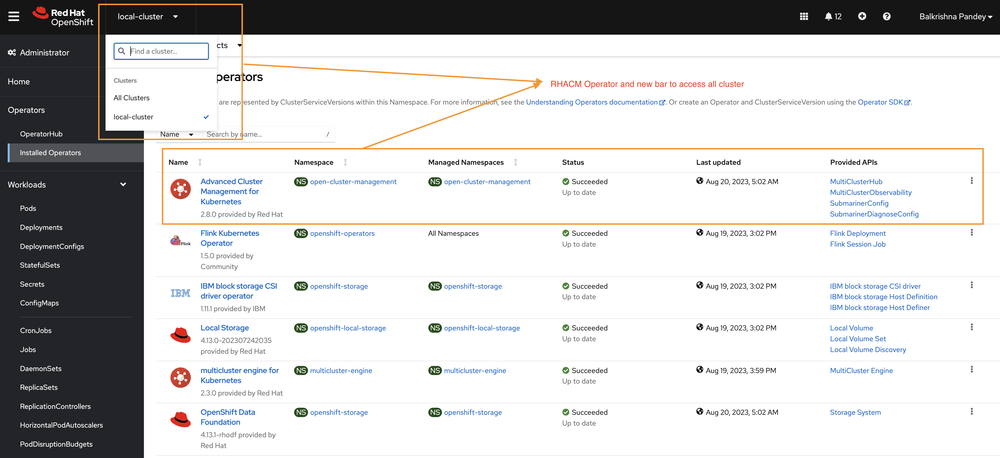
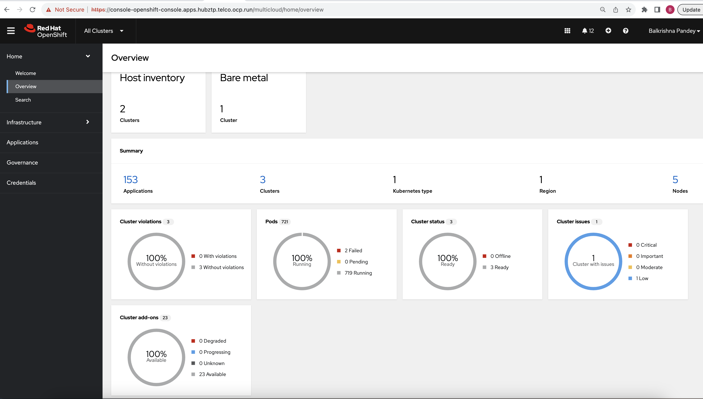

- [GitOps Demonstration with Red Hat Advanced Cluster Management (RHACM) and Assisted Installer](#gitops-demonstration-with-red-hat-advanced-cluster-management-rhacm-and-assisted-installer)
  - [Objective](#objective)
  - [000 - Overview](#000---overview)
    - [Red Hat Advanced Cluster Management (RHACM):](#red-hat-advanced-cluster-management-rhacm)
    - [Assisted Installer:](#assisted-installer)
    - [KVM \& Sushy-Tools:](#kvm--sushy-tools)
    - [Red Hat GitOps \& Tekton Pipelines:](#red-hat-gitops--tekton-pipelines)
  - [001 - Bridge Network Setup - `br0` - Optional](#001---bridge-network-setup---br0---optional)
    - [Preface](#preface)
    - [Objective](#objective-1)
    - [Steps to Set Up `br0`](#steps-to-set-up-br0)
    - [Post-setup Configuration Details](#post-setup-configuration-details)
    - [Important Notes](#important-notes)
  - [002 - Hub Cluster Setup - hubztp](#002---hub-cluster-setup---hubztp)
    - [Generating ISO Image using Assisted Installer](#generating-iso-image-using-assisted-installer)
    - [Important Notes](#important-notes-1)
    - [Downloading the ISO Image for `hubztp`](#downloading-the-iso-image-for-hubztp)
    - [Attaching Additional Storage to Hub Cluster VMs for ODF](#attaching-additional-storage-to-hub-cluster-vms-for-odf)
    - [Setting Up Hub Cluster VMs](#setting-up-hub-cluster-vms)
    - [Completing Cluster Installation via Red Hat Console](#completing-cluster-installation-via-red-hat-console)
  - [003 - Setting Up Sushy Tool](#003---setting-up-sushy-tool)
    - [Install and configure Sushy](#install-and-configure-sushy)
    - [Validate](#validate)
  - [004 - Local Storage Setup for OpenShift Data Foundation](#004---local-storage-setup-for-openshift-data-foundation)
    - [Installing the Local Storage Operator](#installing-the-local-storage-operator)
    - [Node Preparation](#node-preparation)
    - [Auto Device Discovery \& Persistent Volumes Creation](#auto-device-discovery--persistent-volumes-creation)
    - [LocalVolumeSet Creation](#localvolumeset-creation)
  - [005 - OpenShift Data Foundation (ODF) Setup](#005---openshift-data-foundation-odf-setup)
    - [Installing the ODF Operator](#installing-the-odf-operator)
    - [Creating the Storage Cluster](#creating-the-storage-cluster)
    - [Verifying the Installation](#verifying-the-installation)
    - [Testing with PVCs](#testing-with-pvcs)
  - [006 - OpenShift GitOps Operator Setup](#006---openshift-gitops-operator-setup)
    - [Installation](#installation)
    - [Verifying the Installation](#verifying-the-installation-1)
  - [007 - Installing Red Hat Advanced Cluster Management (RHACM) with ArgoCD](#007---installing-red-hat-advanced-cluster-management-rhacm-with-argocd)
    - [Prerequisites](#prerequisites)
    - [Understanding AppProject and ApplicationSet in ArgoCD](#understanding-appproject-and-applicationset-in-argocd)
    - [Deploying the AppProject and ApplicationSet](#deploying-the-appproject-and-applicationset)
    - [Monitoring the Deployment in ArgoCD](#monitoring-the-deployment-in-argocd)
    - [Verifying the Installation](#verifying-the-installation-2)

# GitOps Demonstration with Red Hat Advanced Cluster Management (RHACM) and Assisted Installer

## Objective

The primary goal of this project is to showcase the GitOps functionality using a combination of Red Hat tools, emulated bare metal infrastructure, and Tekton pipelines.


## 000 - Overview
This demonstration integrates several tools and technologies to showcase the power and flexibility of GitOps in a modern infrastructure:

### Red Hat Advanced Cluster Management (RHACM):
- RHACM is a comprehensive cluster management solution from Red Hat, designed to simplify the life-cycle of Kubernetes clusters, from creation to management and application deployment.
- Role in this project: RHACM will oversee and manage the Kubernetes clusters, ensuring they're compliant with defined policies, and helping in scaling, upgrading, or recovering clusters as necessary.

### Assisted Installer:
- An innovative deployment tool crafted for OpenShift Container Platform (OCP) clusters. It streamlines the process of setting up a Kubernetes cluster, especially on challenging environments like bare metal.
- Role in this project: We'll use Assisted Installer to deploy OCP onto our emulated bare metal environment. It'll interact with the emulated Redfish API, believing it's deploying to genuine bare metal servers.

### KVM & Sushy-Tools:
- KVM stands for Kernel-based Virtual Machine, a virtualization technology built into the Linux kernel. Sushy-Tools, on the other hand, simulates a Redfish API for systems that lack genuine Redfish support, like our KVM virtual machines.
- Role in this project: KVM creates the foundational virtual infrastructure for our demonstration. Sushy-Tools will act as a translator, making these VMs appear as Redfish compliant bare metal machines. This illusion allows Assisted Installer to deploy OCP clusters as if it's a true bare metal environment.

### Red Hat GitOps & Tekton Pipelines:
- Red Hat GitOps is a solution that enforces infrastructure and application configurations to be defined and stored in a Git repository. Tekton Pipelines is a powerful Kubernetes-native CI/CD solution that can be used to deploy and manage applications and infrastructure.
- Role in this project: With the GitOps principle, any change to our infrastructure or application state will start as a change in our Git repository. Tekton Pipelines will continuously ensure that our live environment matches this desired state, making the infrastructure-as-code paradigm a reality.

## 001 - Bridge Network Setup - `br0` - Optional
### Preface
The instructions in this section are specific to our project infrastructure, revolving around the use of the `eno1np0` physical interface to create a bridge network. While multiple methods exist to set up bridge networks, the steps detailed here are based on our unique configuration.

If your environment or requirements differ, you may choose to adapt the steps provided or skip this section.

### Objective
For this project, we are creating a bridge network, named `br0`, to link our KVM virtual machines to the external network. This ensures seamless communication and proper network functionality between our VMs and the broader environment.

### Steps to Set Up `br0`
- Navigate to the setup directory:
```
cd 001-hubcluster-setup
```
- Run the bridge network creation script:
```
bash 001-create-bridge-network.sh
```
Executing this script will automate the creation of the `br0` bridge using the eno1np0 physical interface and assign it an IP address of `192.168.7.212/22`.

### Post-setup Configuration Details
- Physical Interface (eno1np0): Retains its IP address (`192.168.7.213/24`) even after the bridge's creation.
- Bridge Interface (br0): Acquires an IP address of `192.168.7.212/22`. This address will be used by VMs or other devices connected to the bridge for external communications.

### Important Notes
- The `br0` bridge acts much like a switch, with `eno1np0` serving as its port. VMs connected to this bridge can interact with the physical network via `eno1np0`.
- It's crucial to ensure that firewall settings, if applicable, are adjusted to facilitate traffic through both the `br0` interface and `eno1np0`.
- Remember, this is a unique configuration where both the bridge and the physical interface retain individual IP addresses. Ensure proper routing and network configurations to avoid potential issues.

## 002 - Hub Cluster Setup - hubztp
In this section, we'll focus on setting up a hub cluster consisting of three nodes. This cluster setup will leverage virtual machines (VMs) to simulate bare metal nodes. For ease of setup, we have a scripted approach.

### Generating ISO Image using Assisted Installer
The first step is to generate the necessary ISO image to provision the hub cluster nodes:
- Visit [Red Hat OpenShift Cluster Manager](https://console.redhat.com/).
- Navigate to the [Assisted Installer](https://console.redhat.com/openshift/create/datacenter) service.
- Follow the instructions to generate an ISO image tailored for your hub cluster setup. This image will be used to boot and provision the nodes.


### Important Notes
- Ensure that all prerequisites, especially QEMU and `virt-install`, are already installed and configured on the system.
- As the VMs are simulating bare metal nodes, ensure the ISO generated from the Assisted Installer is compatible and has the necessary drivers and configurations.
- Monitoring the provisioning process from the Assisted Installer on the Red Hat OpenShift Cluster Manager portal will give you a real-time status of each node and the overall cluster setup.

### Downloading the ISO Image for `hubztp`
After generating the ISO image using Assisted Installer, the next step is to download it. This image contains all the configurations and software needed to provision our simulated bare metal nodes, i.e., the virtual machines we are going to set up in the next section.

Once the ISO generation is complete, you'll find a download option for the ISO in the Assisted Installer section of the Red Hat OpenShift Cluster Manager portal.


### Attaching Additional Storage to Hub Cluster VMs for ODF
To accommodate the storage needs of the OpenShift Data Foundation (ODF) component, an additional 50G of storage will be attached to each node in the hub cluster. Using the QEMU tool, a 50G virtual disk image in the qcow2 format is created for each node in the hub cluster.
Navigate to the `001-hubcluster-setup` directory and run:
```
cd 001-hubcluster-setup
bash 003-attach-disk-for-odf.sh
```

After attaching the storage to the VMs, it's necessary to ensure that the new disk does not retain any old metadata.

To SSH into the VMs, you'll first need their IP addresses. These can be obtained in two primary ways:
- From the console.redhat.com cluster host list page. Navigate to the appropriate section and look for the IP addresses associated with the nodes of the hub cluster.
- From your router's configuration or management interface. Depending on your router's make and model, navigate to the connected devices or DHCP clients section to locate the IP addresses assigned to the VMs.

Once you have the IP addresses, SSH into each VM:
```
ssh core@[VM_IP_ADDRESS]
```
After accessing the VM, run the following command to clear any existing filesystem signatures:
```
sudo wipefs -a /dev/vdb
```
This step ensures the additional storage attached to each VM is ready and optimized for ODF usage.

> Note: These steps are essential for the proper functioning of the ODF storage component in the hub cluster. They ensure sufficient storage capacity and a fresh, unformatted disk to be managed and used by ODF.

### Setting Up Hub Cluster VMs
The script uses QEMU to create images and `virt-install` to set up the VMs. It sets up three nodes, each with 50GB of RAM and 16 vCPUs, using the `qcow2` format for the virtual hard drives.

- Each VM image is created with a size of 200GB.
- The virtual machines are named with a pattern (`${CLUSTER_NAME}-master-x`).
- VMs are associated with the `br0` network bridge created in the previous step.
- A unique MAC address is assigned to each VM for identification.

> Caution: The ISO location in the script is hardcoded. Ensure to download the ISO to the specified location: `/opt/ssd/boot/discovery_image_${CLUSTER_NAME}.iso` or adjust the script accordingly.

Navigate to the `001-hubcluster-setup` directory and run:
```
cd 001-hubcluster-setup
bash 002-create-hubvms-mno.sh
```

This script initializes the VMs and starts them.

### Completing Cluster Installation via Red Hat Console
After initializing and starting the VMs as part of the hub cluster setup, the next step involves finalizing the cluster installation process through the Red Hat Console. Once the cluster is up and running you can download the kubeconfig file from Red Hat Console page.

## 003 - Setting Up Sushy Tool

### Install and configure Sushy
The Sushy tool serves as an emulator for Redfish, which is a standard protocol for managing servers. This guide will walk you through the steps to set up the Sushy tool by following the steps outlined in the [cloudcult.dev](https://cloudcult.dev/sushy-emulator-redfish-for-the-virtualization-nation/) blog post. All scripts is placed in the 002-sushy-tool-setup/001-sushy-setup.sh file.

```
cd 002-sushy-tool-setup
bash 001-sushy-setup.sh
```

> Notes: Ensure Podman and other dependencies are installed and up-to-date before starting this process.

### Validate
To validate that the Sushy tool is up and running and to check if VMs are exposed using this tool, you can follow these steps:
- Check if the sushy-emulator service is running:
```
sudo systemctl status sushy-emulator.service
```
You should see an `active (running)` status if it's operational.

- Curl the Redfish endpoints:
The Sushy emulator imitates a Redfish interface. You can use curl to query the base Redfish endpoint to see if it responds:
```
curl http://localhost:8000/redfish/v1/
```
This should return a JSON response with various Redfish details if the emulator is running and functioning correctly.

- Check for VMs
Redfish organizes servers into Systems. You can list the systems (VMs in this context) that the emulator is exposing:
```
curl http://localhost:8000/redfish/v1/Systems/
```
This should provide you with a list of systems (VMs) that are being managed by the Sushy emulator.

- Specific VM Details:
If you want details on a specific VM, use the `Id` from the above command and query:
```
curl http://localhost:8000/redfish/v1/Systems/<VM_Id>
```
Replace `<VM_Id>` with the ID of the VM you're interested in. This should give you detailed information about that particular VM.

## 004 - Local Storage Setup for OpenShift Data Foundation
Setting up local storage is a foundational step before deploying OpenShift Data Foundation (ODF) on Red Hat OpenShift Container Platform (OCP).

### Installing the Local Storage Operator
- **Namespace Creation:** Initialize the openshift-local-storage namespace.
```
oc apply -f 003-setup-local-storage/001-namespace-local-storage.yaml
```
- **Operator Group Setup:** Configure the operator group for the Local Storage Operator in this namespace.
```
oc apply -f 003-setup-local-storage/002-operatorgroup-local-storage.yaml
```
- **Subscription:** Subscribe to the local-storage-operator. Make sure the channel matches your OCP version.
```
oc apply -f 003-setup-local-storage/003-subscription-local-storage.yaml
```
> Note: Ensure the Local Storage Operator's channel aligns with your OCP version.

### Node Preparation
- **Node Labeling:** Add the ocs label to each OCP node equipped with storage devices. ODF uses this label to ascertain which nodes to target for its components.
Command (replace `<NodeName>` with your node's name):
```
oc label node <NodeName> cluster.ocs.openshift.io/openshift-storage=''
```

- **Node Requirements:** At least three similarly equipped nodes are necessary. These nodes should be fitted with SSDs or NVMe devices.

### Auto Device Discovery & Persistent Volumes Creation
From versions OCS v4.6 onwards:
- **Auto-Discovery:** The Local Storage Operator can now automatically discover devices on labeled OCP nodes.
```
oc apply -f 003-setup-local-storage/004-local-volume-discovery.yaml
```
- **LocalVolumeDiscovery Resource:** After labeling, instantiate this resource. It will generate localvolumediscoveryresults detailing each disk for every labeled OCP node.
To inspect discovery results:
```
oc get localvolumediscoveries -n openshift-local-storage
oc get localvolumediscoveryresults -n openshift-local-storage
```

### LocalVolumeSet Creation
For ODF:
- **Disk Requirements:** Use only raw block SSDs or NVMe devices. The operator partitions these raw blocks for different requirements.
- **LocalVolumeSet Creation:** Utilize the YAML configuration to initiate the LocalVolumeSet.
```
oc apply -f 003-setup-local-storage/005-local-volume-set.yaml
```
- **Post-Creation Checks:** Confirm that PVs are created for each disk on the labeled nodes after creating the resource.

To validate the setup:
```
oc get pods -n openshift-local-storage | grep "diskmaker-manager"
oc get pv -n openshift-local-storage
```

## 005 - OpenShift Data Foundation (ODF) Setup
### Installing the ODF Operator
- **Namespace Creation:** Create the openshift-storage namespace which also sets up the namespace for cluster monitoring.
```
oc apply -f 004-odf-setup/001-namespace.yaml
```

- **Operator Group Setup:** Establish the openshift-storage-operatorgroup for the ODF Operator within the openshift-storage namespace.
```
oc apply -f 004-odf-setup/002-operator-group.yaml
```

- **Subscription to the OCS Operator:** Depending on your version of OCS, subscribe to the appropriate operator. For OCS version 4.9 and above:
```
oc apply -f 004-odf-setup/003-subscription.yaml
```
> Note: Ensure the channel aligns with your desired OCS version and is compatible with your OCP version.

### Creating the Storage Cluster
- **Storage Cluster CR Creation:** Use the provided configuration for setting up the storage cluster. You might need to adjust parameters such as count for the number of OSDs and storage size based on your infrastructure.
```
oc apply -f 004-odf-setup/004-storage-cluster.yaml
```

### Verifying the Installation
- **Check ODF Pods:** Ensure all pods within the openshift-storage namespace are either in a Running or Completed state.
```
oc get pods -n openshift-storage
```

- **Check CSV Phase:** Confirm that the `odf-operator` are in the "Succeeded" phase.
```
oc get csv -n openshift-storage
```

### Testing with PVCs
- CephRBD PVC Creation:
```
oc apply -f - <<EOF
apiVersion: v1
kind: PersistentVolumeClaim
metadata:
  name: rbd-pvc
spec:
  accessModes:
  - ReadWriteOnce
  resources:
    requests:
      storage: 1Gi
  storageClassName: ocs-storagecluster-ceph-rbd
EOF
```

- CephFS PVC Creation:
```
oc apply -f - <<EOF
apiVersion: v1
kind: PersistentVolumeClaim
metadata:
  name: cephfs-pvc
spec:
  accessModes:
  - ReadWriteMany
  resources:
    requests:
      storage: 1Gi
  storageClassName: ocs-storagecluster-cephfs
EOF
```
- Validation of PVC Creation:
```
oc get pvc | grep rbd-pvc
oc get pvc | grep cephfs-pvc
```

## 006 - OpenShift GitOps Operator Setup
### Installation
- **Namespace Creation:** The OpenShift GitOps Operator will reside in the openshift-gitops namespace. This namespace is also set up to allow for cluster monitoring.
```
oc apply -f 005-openshift-gitops/00-namespace.yaml
```
- **Subscription:** Subscribing to the OpenShift GitOps Operator allows your cluster to receive updates and function in conjunction with GitOps practices. Make sure you've chosen the right version (gitops-1.9 in this case).
```
oc apply -f 005-openshift-gitops/01-subscription.yaml
```

- **RBAC Configuration:** The OpenShift GitOps Operator's application controller requires certain permissions to manage resources related to the MultiClusterHub. To facilitate this, you should set up a ClusterRole and ClusterRoleBinding.

    - **ClusterRole:** Defines the permissions required by the ArgoCD application controller to manage MultiClusterHub resources.
    - **ClusterRoleBinding:** Binds the above ClusterRole to the ArgoCD application controller's service account.

Apply the RBAC configurations:
```
oc apply -f 005-openshift-gitops/02-rbac-multiclusterhub.yaml
```

- **Deploy Everything Using Kustomization:** Instead of applying each resource individually, you can utilize kustomize to deploy all manifests at once. This is beneficial for managing and organizing resources.
```
oc apply -k 005-openshift-gitops/
```

### Verifying the Installation
- **Check Pod Status:** Before proceeding, it's crucial to ensure all related pods are up and running in the openshift-gitops namespace.
```
oc get pods -n openshift-gitops
```
Expected Output:
```
NAME                                                         READY   STATUS    RESTARTS   AGE
cluster-6b8c7b49f-vx2vr                                      1/1     Running   0          80m
kam-59fd558fcb-s6ncn                                         1/1     Running   0          80m
openshift-gitops-application-controller-0                    1/1     Running   0          80m
openshift-gitops-applicationset-controller-7d5bf7f69-vncj4   1/1     Running   0          80m
openshift-gitops-dex-server-f69dd7684-bnh95                  1/1     Running   0          80m
openshift-gitops-redis-bb656787d-jk7j5                       1/1     Running   0          80m
openshift-gitops-repo-server-6bf856897c-zm2rw                1/1     Running   0          80m
openshift-gitops-server-7ffc6ff594-hqfh7                     1/1     Running   0          80m
```
- **Access Argo CD Console:** To confirm that Argo CD has been properly set up, fetch the route to its console and access it in your web browser.
```
oc get route openshift-gitops-server -n openshift-gitops --template='https://{{.spec.host}}'
```

Output:
```
https://openshift-gitops-server-openshift-gitops.apps.sno01.telco.ocp.run
```

Access the ArgoCD UI. Once logged in, you should be greeted with the ArgoCD dashboard displaying various applications, clusters, and repositories (empty by default).



- **OpenShift Console Verification:** Open your OpenShift Console and navigate to the installed operators list. You should be able to see the "OpenShift GitOps Operator" listed as one of the installed operators. Additionally, check for the ArgoCD navigation menu from the top right menu bar to confirm the successful installation.



## 007 - Installing Red Hat Advanced Cluster Management (RHACM) with ArgoCD
### Prerequisites
Ensure that ArgoCD and OpenShift GitOps operator are installed and correctly configured. If not, refer to the previous section on setting them up.

### Understanding AppProject and ApplicationSet in ArgoCD
Before we begin, it's essential to understand the components:

- **AppProject:** In ArgoCD, an AppProject is a custom resource that provides a logical grouping of applications. It defines a set of rules which can restrict source repositories, destination clusters & namespaces, and can be used to control what cluster-wide resources can be defined within the project.

- **ApplicationSet:** An ApplicationSet is a custom resource introduced to ArgoCD that provides automation in generating ArgoCD Applications. It lets you deploy applications across multiple clusters and namespaces, source multiple repositories, and more.

If you look at the content of ApplicationSet which refer to the repository https://github.com/pandeybk/rhacm-gitops-demo.git and will deploy the RHACM operator based on the manifests available in the resources/rhacm-operator directory.

### Deploying the AppProject and ApplicationSet
- Use Kustomize to Apply AppProject and ApplicationSet:
```
oc apply -k 006-advance-cluster-management/
```

This command will create both the `AppProject` and `ApplicationSet` in the `openshift-gitops` namespace.

### Monitoring the Deployment in ArgoCD
Once the AppProject and ApplicationSet are deployed:

Navigate to the ArgoCD dashboard. Under the "Applications" tab, you will observe the deployment progress of the "advance-cluster-management" application.



Click on the "advance-cluster-management" application for a detailed view. This will give you an idea of the resources being deployed, their health, and sync status. As ArgoCD pulls the manifests from the GitHub repository and begins the deployment, you can watch the progress in real-time. The resources, including the RHACM namespace, operator group, subscription, and multicluster hub, will get deployed in sequence.



###  Verifying the Installation
Upon successful deployment:
- **Check the RHACM Resources in OpenShift:** Verify that the RHACM resources are correctly deployed in the open-cluster-management namespace.
```
oc get all -n open-cluster-management
```
You should see the RHACM resources, including the multicluster hub, running smoothly.

- **Inspect the OpenShift Console:** Navigate to the OpenShift console. In the installed operators list, you should see the RHACM operator listed as "Installed" and "Succeeded".

Moreover, a new menu item to access the multicluster hub should be visible, indicating that RHACM is fully integrated with your OpenShift cluster.


- **Access the RHACM Dashboard:** Click on the "All Clusters" menu item from the drop list. This action should redirect you to the RHACM dashboard. The dashboard provides a comprehensive view of all your managed clusters, their health, and other associated details (empty  by dafault).

