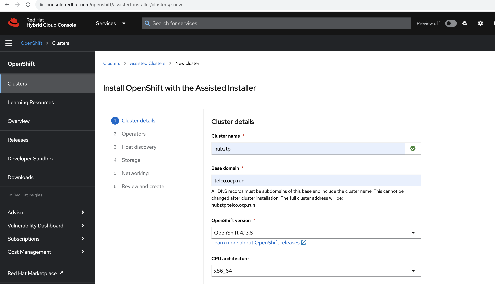

## Hub Cluster Setup - hubztp
In this section, we'll focus on setting up a hub cluster consisting of three nodes. This cluster setup will leverage virtual machines (VMs) to simulate bare metal nodes. For ease of setup, we have a scripted approach.

### Setting Up Hub Cluster VMs
#### Preparation
The script uses QEMU to create images and `virt-install` to set up the VMs. It sets up three nodes, each with 50GB of RAM and 16 vCPUs, using the `qcow2` format for the virtual hard drives.

- Each VM image is created with a size of 200GB.
- The virtual machines are named with a pattern (`${CLUSTER_NAME}-master-x`).
- VMs are associated with the `br0` network bridge created in the previous step.
- A unique MAC address is assigned to each VM for identification.

#### Script Execution:
Navigate to the `001-hubcluster-setup` directory and run:
```
cd 001-hubcluster-setup
bash 002-create-hubvms-mno.sh
```

This script initializes the VMs and starts them.

### Generating ISO Image using Assisted Installer
Post VM setup, the next step is to generate the necessary ISO image to provision the hub cluster nodes:
- Visit [Red Hat OpenShift Cluster Manager](https://console.redhat.com/).
- Navigate to the [Assisted Installer](https://console.redhat.com/openshift/create/datacenter) service.
- Follow the instructions to generate an ISO image tailored for your hub cluster setup. This image will be used to boot and provision the nodes.


### Important Notes
- Ensure that all prerequisites, especially QEMU and `virt-install`, are already installed and configured on the system.
- As the VMs are simulating bare metal nodes, ensure the ISO generated from the Assisted Installer is compatible and has the necessary drivers and configurations.
- Monitoring the provisioning process from the Assisted Installer on the Red Hat OpenShift Cluster Manager portal will give you a real-time status of each node and the overall cluster setup.
